# Bank Account Service

## BankAccount Entity
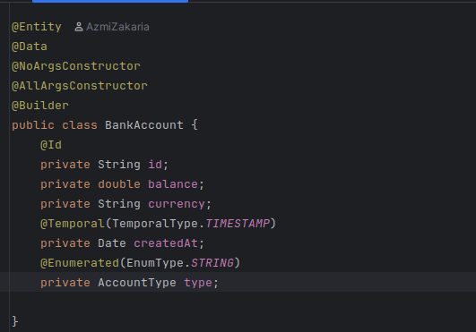

## BankAccount Respository
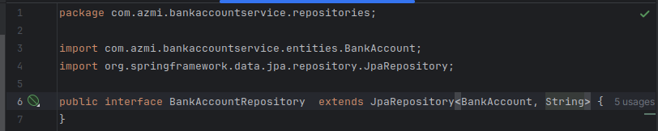

## Application properties configue
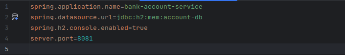

## Teste de couche DAO
### Ajout des accounts
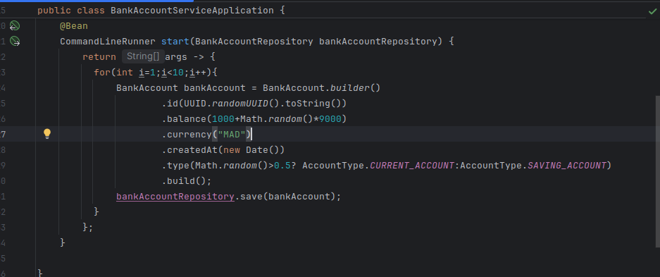
### Visualiser la table dans H2 DB
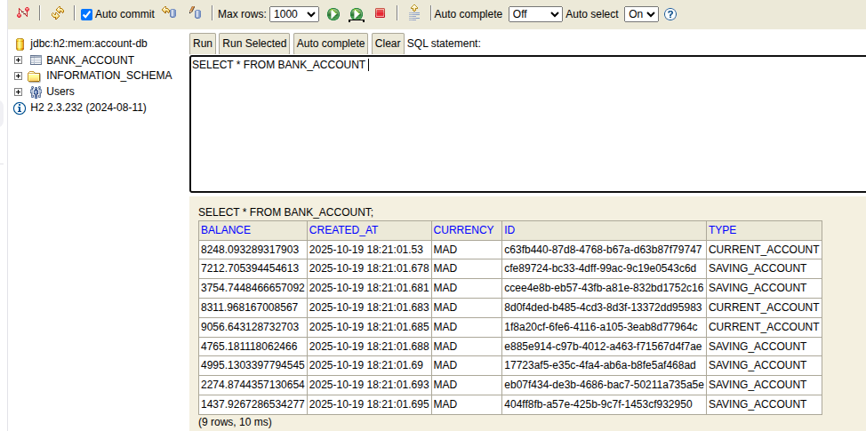

## Web service Restfull
### List all bank accounts
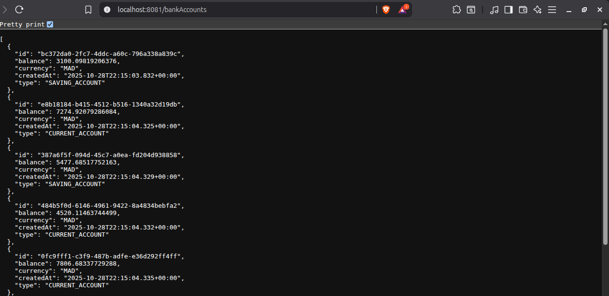
### List bank account by id

### Save bank account
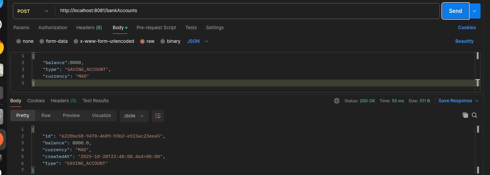
### Update Account by id
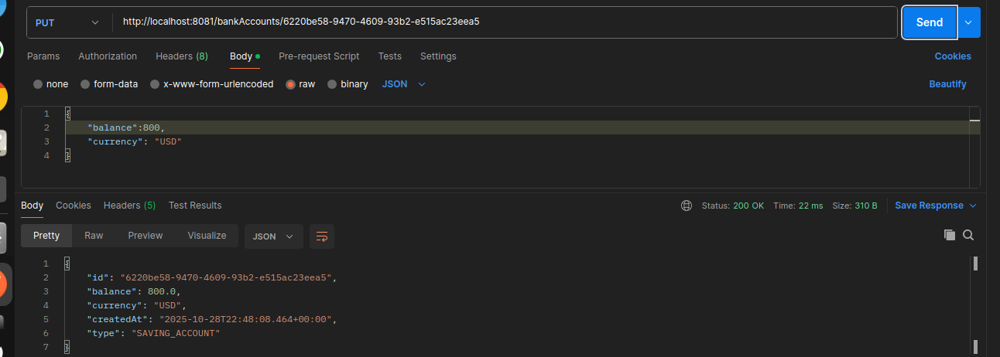
### Delete Account bu id
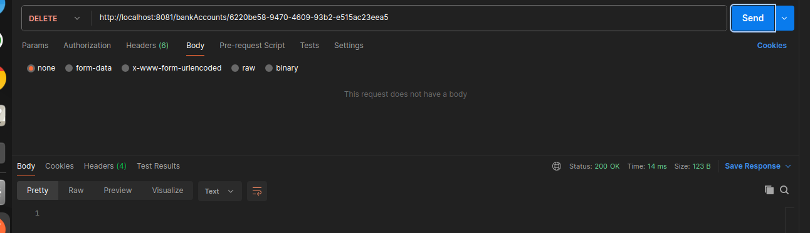

## Spring Data Rest
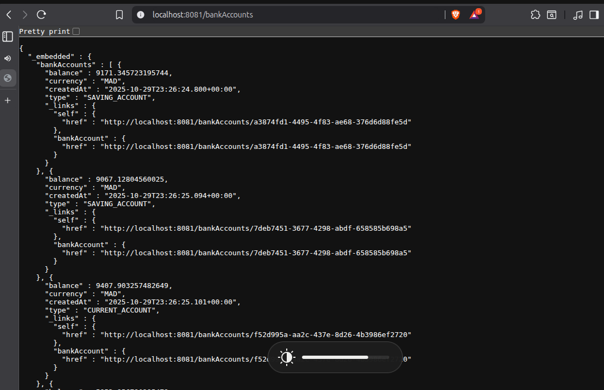
### Projection interface
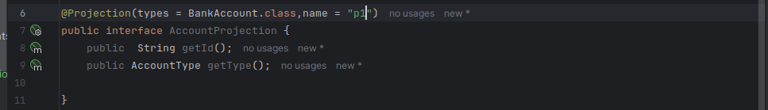
### Projection resultat
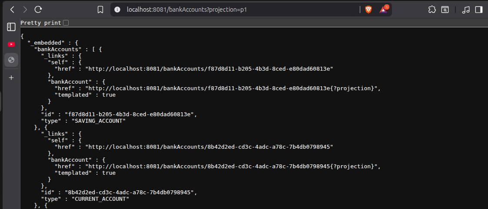

